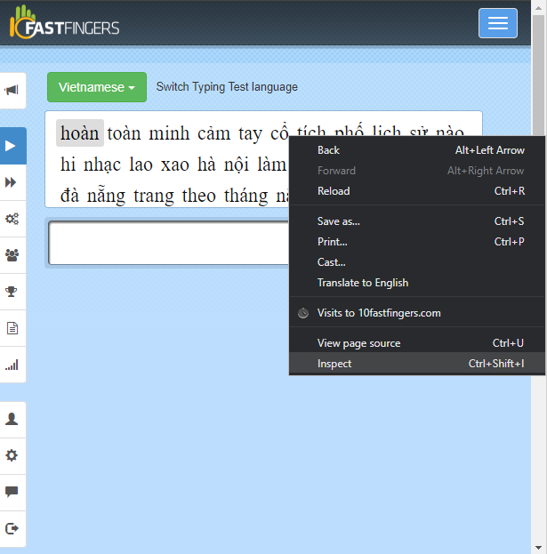
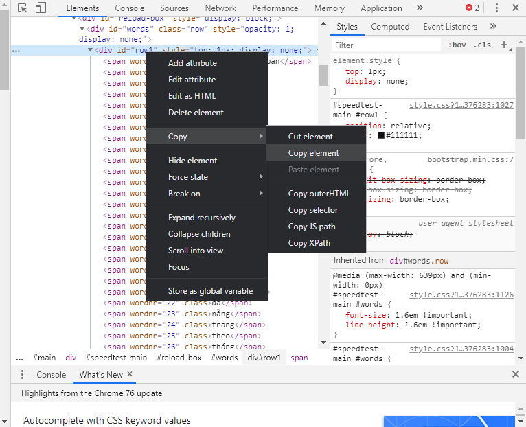

# 10fastfingers_noob_python
## One of the bullshit stuff I've made
### Required Installation:
#### If you don't know how to, google it.
- Python 3
- https://pypi.org/project/pynput/
### How to use:
- First you have open the website https://10fastfingers.com/.

- Then you right click the box and choose Inspect.

- Then you right click that line and choose Copy Element to copy the needed text.

- After that you paste the copied text to key.txt file and  delete everything before the first "<span".
- Run the program with "python main.py" in the terminal.
- Note: You'll have 5 seconds after you run the program to click the typing box.
- Another note: You have to change the source code to change the typing speed because I'm lazy af.
